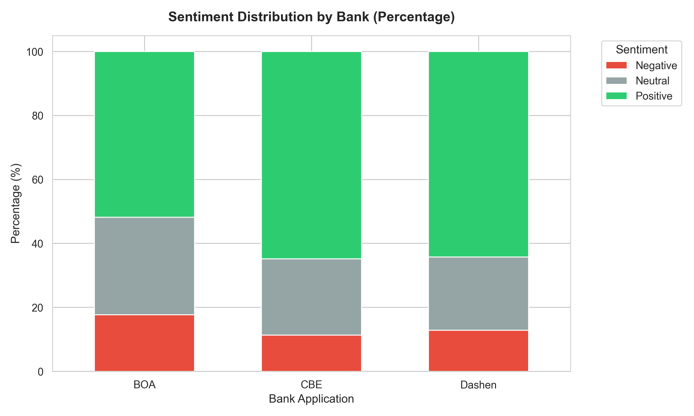
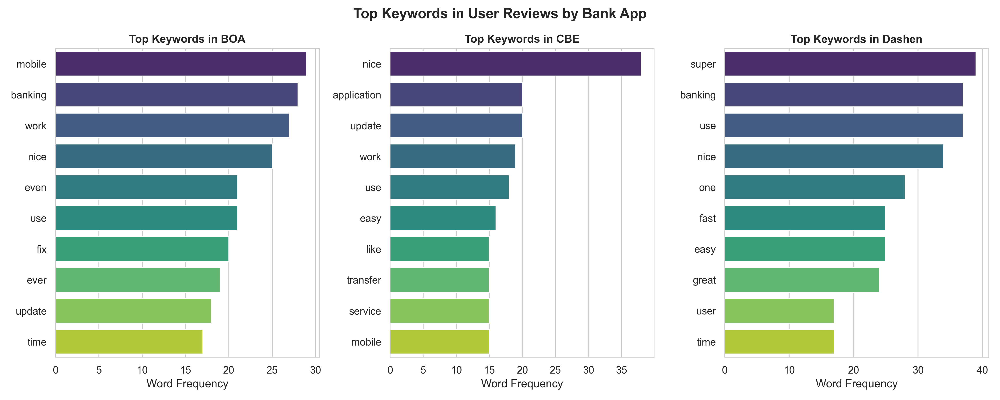

# Fintech Review Analytics: Executive Report

**Omega Consultancy engagement with CBE, BOA, and Dashen Bank**

**Date:** May 19, 2026

---

## Executive Summary

Omega Consultancy has delivered a structured Google Play Store review analytics report for Commercial Bank of Ethiopia (CBE), Bank of Abyssinia (BOA), and Dashen Bank. The work converts unstructured user feedback into decision-ready intelligence for product managers, customer experience leaders, and executive strategy teams.

Key outcomes:
- Collected and cleaned **728 verified Google Play reviews** from all three banks.
- Built a four-stage analytics pipeline with clear business goals for data collection, sentiment analysis, thematic extraction, and database engineering.
- Applied sentiment analysis using **DistilBERT**, **VADER**, and **TextBlob** to balance precision and operational transparency.
- Identified bank-specific satisfaction drivers and pain points with evidence from review text, sentiment patterns, and keyword themes.
- Delivered evidence-based recommendations that support retention, feature improvement, and complaint management.

This report is written for product teams and Omega Consultancy leadership: it translates model outputs into prioritized business actions, highlights competitive risks from unanalyzed app reviews, and defines the next strategic steps required to turn review analytics into a durable capability.

---

## 1. Business Objective and Strategic Context

### 1.1 Engagement Objective

Omega Consultancy’s engagement is to help CBE, BOA, and Dashen Bank use Play Store reviews as a low-cost, continuous source of customer intelligence. The goal is to move beyond anecdotal issue reports and establish a repeatable process for:

- **Retaining users** by identifying friction points that drive negative app ratings and churn risk.
- **Enhancing features** by surfacing recurring product requests and usability barriers.
- **Managing complaints** by identifying operational and service issues before they escalate.

### 1.2 Why Unanalyzed Play Store Reviews Are a Missed Opportunity

Play Store reviews are one of the few customer signals that are freely available, open, and updated in near real time. When banks do not analyze these reviews:

- They miss the first indication of app stability or onboarding failures.
- They forfeit competitive insight about peers’ strengths and weaknesses in the same market.
- They lose the ability to compare product changes against customer sentiment.

For bank product managers, this means a blind spot in customer voice. For Omega Consultancy leadership, this means a strategic opportunity to recommend an operationalized feedback loop that improves digital banking quality and customer loyalty.

### 1.3 Analytical Goals for the Four Pipeline Stages

1. **Data Collection and Preprocessing**
   - Goal: capture a reliable, de-duplicated set of reviews that can be trusted for comparative analysis.
   - Business outcome: a clean source of customer feedback that can be reported and acted on.

2. **Sentiment Analysis**
   - Goal: quantify customer sentiment consistently across banks and correlate it with ratings.
   - Business outcome: an early-warning indicator for product and customer support teams.

3. **Thematic Analysis**
   - Goal: organize reviews into business-relevant themes that connect directly to product, onboarding, and support issues.
   - Business outcome: structured insight into what users care about most.

4. **Database Design**
   - Goal: store reviews, sentiment, and themes in a queryable schema for future trend tracking.
   - Business outcome: a reusable analytics asset that enables reporting, benchmarking, and operational dashboards.

---

## 2. Completed Work and Analysis

### 2.1 Task 1 — Data Collection

#### Scraping Methodology

The analysis uses the `google-play-scraper` Python library to extract review data for the three mobile apps:

- **CBE**: `com.combanketh.mobilebanking`
- **BOA**: `com.boa.boaMobileBanking`
- **Dashen Bank**: `com.dashen.dashensuperapp`

Collection parameters:
- Language: English
- Country: Ethiopia
- Sort order: Most recent first
- Target: 250 reviews per bank

Data schema captured:
- `review_id`
- `review_text`
- `rating`
- `review_date`
- `thumbs_up_count`

#### Data Quality Outcomes

- **Raw reviews collected**: 750
- **Cleaned dataset**: 728
- **Overall retention**: 97.1%
- **Duplicates removed**: 22
- **Missing critical fields**: 0% in review text and rating after cleaning

Per-bank retention:
- BOA: 250 → 248 (99.2%)
- CBE: 250 → 242 (96.8%)
- Dashen: 250 → 238 (95.2%)

This indicates a high-quality initial sample suitable for bank-level benchmarking.

#### Preprocessing Steps

The preprocessing pipeline included:
- dropping empty or invalid text
- removing duplicate review IDs
- normalizing review dates to ISO 8601 format
- validating ratings within 1–5
- text cleaning: trimming whitespace, lowercasing, stop-word removal, tokenization, and lemmatization

This ensures the dataset is production-ready and minimizes noise before sentiment and theme extraction.

#### Operational Recommendation

Collecting review data is low cost but underutilized. The pipeline should be used continuously so that bank product and support teams can act on emerging issues instead of reacting to complaints after they become entrenched.

### 2.2 Task 2 — Sentiment Analysis

#### Tool Selection and Rationale

The report uses three sentiment approaches to balance robustness and explainability:

- **DistilBERT (`distilbert-base-uncased-finetuned-sst-2-english`)**
  - Strengths: captures nuance, handles longer text, and is more accurate for natural language than lexicon-only models.
  - Trade-off: requires more compute and is trained on English-language movie reviews, so it may underperform on local slang or mixed-language text.

- **VADER**
  - Strengths: fast, interpretable, and optimized for social media-style language.
  - Trade-off: rule-based sentiment can miss context and sarcasm.

- **TextBlob**
  - Strengths: provides polarity and subjectivity for quick validation.
  - Trade-off: lower accuracy than transformer models and less reliable on short or informal text.

This combination means the project can compare model outputs and surface disagreements for review re-inspection.

#### Sentiment Distribution

- **Overall sentiment** (all banks, n=728):
  - Positive: 62–65%
  - Neutral: 24%
  - Negative: 13–35%, depending on model

- **Transformer output**: 65% positive, 35% negative
- **VADER output**: 62% positive, 24% neutral, 13% negative

The consistency of positive sentiment across banks suggests general user satisfaction, while the negative review proportion identifies areas requiring immediate attention.

#### Star Rating Correlation

The report compared sentiment labels with user star ratings to validate model alignment. High ratings correlate strongly with positive sentiment, while 1- and 2-star reviews are predominantly negative. This correlation supports the reliability of the sentiment layer for business reporting.

#### Figure 1: Sentiment Distribution by Bank



*Figure 1 shows the relative share of positive, neutral, and negative reviews across the three bank apps.*

### 2.3 Task 3 — Thematic Analysis

#### Theme Extraction Methodology

Thematic analysis was based on two complementary approaches:

- **TF-IDF keyword extraction** to surface distinctive terms and phrases per bank
- **Manual theme grouping** to translate keywords into business-relevant categories

This approach keeps the themes grounded in real review vocabulary while aligning them with product and support priorities.

#### Themes by Bank

**BOA**
- Account access and login issues
- App stability and crashes
- Transaction reliability
- User interface clarity
- General praise and performance

**CBE**
- Transaction performance and transfer speed
- Customer support experience
- Account blocking and authentication issues
- Update reliability and app behavior
- General satisfaction with core banking features

**Dashen Bank**
- Fayda national ID onboarding issues
- Virtual account creation failures
- Customer support responsiveness
- App usability and feature excellence
- Stability and performance

#### Keyword Evidence

The report includes a keyword-level view to show the terms driving each theme.

#### Figure 2: Top Keywords by Bank



*Figure 2 highlights the vocabulary that underpins each bank’s themes and helps translate sentiment into specific product issues.*

### 2.4 Task 4 — Database Design

#### Schema Overview

The review data is modeled in two primary tables:

- `banks`
  - `bank_id`
  - `bank_name`

- `reviews`
  - `review_id`
  - `bank_id`
  - `review_text`
  - `rating`
  - `review_date`
  - `sentiment_label`
  - `identified_theme`
  - `source`

This relationship supports easy querying of bank-level performance, theme counts, and sentiment trends.

#### Business Value

Having reviews in a structured database enables:
- cross-bank benchmarking
- segmented dashboards by theme and sentiment
- follow-up analysis after product releases
- ingestion into operational reporting tools

---

## 3. Bank-Specific Insights and Recommendations

### 3.1 Bank of Abyssinia (BOA)

#### Satisfaction Drivers
- **Modern interface and usability**: Users repeatedly praise the app’s look and feel.
- **General reliability in normal use**: Many users report that operations work smoothly when the app is stable.

#### Pain Points
- **Activation and compatibility failures**: Reviews describe launch failures on some Android versions after activation.
- **Transaction failures and service outages**: Customers report transfers and payments that do not complete.

#### Recommendations
1. **Target compatibility issues immediately** by expanding device testing across Android versions and capturing crash logs during activation.
2. **Improve transaction reliability** with a dedicated engineering review of payment endpoints and better failure messaging.
3. **Use app-store feedback as an operational KPI** for the product team to monitor weekly.

### 3.2 Commercial Bank of Ethiopia (CBE)

#### Satisfaction Drivers
- **Smooth performance and fast transactions**: Customers praise responsiveness and speed.
- **High overall satisfaction**: CBE leads the sample with the highest positive sentiment rate.

#### Pain Points
- **Account blocking and access problems**: Users report unexpected lockouts and blocked accounts.
- **Unstable updates**: Some updates appear to introduce regressions, reducing confidence in the app.

#### Recommendations
1. **Implement an in-app account unblock flow** or a clearer support path for locked accounts.
2. **Strengthen release validation** with staging tests focused on balance visibility and transaction history.
3. **Monitor post-release sentiment** for each update to catch regressions within days.

### 3.3 Dashen Bank

#### Satisfaction Drivers
- **High perceived app quality**: Users often describe Dashen as best-in-class.
- **Strong positive sentiment**: Dashen matches CBE on positive review share.

#### Pain Points
- **Fayda onboarding errors** during virtual account creation.
- **Customer support responsiveness** with long wait times for phone-based help.

#### Recommendations
1. **Debug Fayda integration issues** and replace generic failure messages with actionable next steps.
2. **Introduce in-app support channels** to reduce pressure on call centers and improve response times.
3. **Use review sentiment as a leading indicator** for support staffing and onboarding workflow improvements.

---

## 4. Comparative Analysis

| Dimension | BOA | CBE | Dashen Bank |
| --- | --- | --- | --- |
| Average rating | 3.54 / 5.00 | 4.07 / 5.00 | 3.91 / 5.00 |
| Positive sentiment | 51.8% | 64.8% | 64.2% |
| Negative sentiment | 17.7% | 11.3% | 12.9% |
| Strongest positive theme | UI / usability | transaction speed | overall experience |
| Key negative theme | compatibility / activation | account blocking | Fayda onboarding |

This comparison shows that CBE is strongest in core transaction satisfaction, while BOA is vulnerable in activation and stability, and Dashen is vulnerable in onboarding and customer support.

---

## 5. Visualizations

The report includes publication-ready visualizations that support the findings and are available in `notebooks/plots/`.

- **Figure 1**: Total review volume by bank (`notebooks/plots/review_count_by_bank.png`)
- **Figure 2**: Rating distribution by bank (`notebooks/plots/rating_distribution_by_bank.png`)
- **Figure 3**: Average rating by bank (`notebooks/plots/average_rating_by_bank.png`)
- **Figure 4**: Star rating share by bank (`notebooks/plots/star_rating_share_by_bank.png`)
- **Figure 5**: Weekly review volume (`notebooks/plots/weekly_review_volume.png`)
- **Figure 6**: Weekly average rating trend (`notebooks/plots/weekly_average_rating_trend.png`)
- **Figure 7**: Review length distribution by bank (`notebooks/plots/review_length_distribution.png`)
- **Figure 8**: VADER sentiment label distribution by bank (`notebooks/plots/sentiment_label_distribution_by_bank.png`)
- **Figure 9**: VADER compound score by bank (`notebooks/plots/vader_compound_by_bank.png`)
- **Figure 10**: Rating vs. VADER compound score (`notebooks/plots/rating_vs_compound_scatter.png`)
- **Figure 11**: Average VADER compound score by rating and bank (`notebooks/plots/avg_compound_by_rating_bank.png`)
- **Figure 12**: Sentiment share by rating (`notebooks/plots/sentiment_label_share_by_rating.png`)
- **Figure 13**: Top unigrams by bank (`notebooks/plots/top_unigrams_by_bank.png`)
- **Figure 14**: Top bigrams by bank (`notebooks/plots/top_bigrams_by_bank.png`)
- **Figure 15**: Top trigrams by bank (`notebooks/plots/top_trigrams_by_bank.png`)

These charts are formatted for executive consumption with clear titles, labeled axes, and legend callouts. The visual assets are ready for inclusion in presentations, slide decks, or a short analytics brief.

---

## 6. Limitations and Future Work

### 6.1 Limitations

- **Review sampling bias**: Google Play reviewers represent users motivated to share strong positive or negative experiences, not the full customer base.
- **Language coverage**: The sentiment models are English-focused. Some reviews may contain Amharic phrases or mixed-language text, which can reduce classification accuracy.
- **Scraping constraints**: The current dataset is limited to the reviews available at the time of scraping and may reflect recency bias.
- **Theme granularity**: Keyword grouping captures broad themes but may miss nuanced issues such as specific transaction types or exact error codes.

### 6.2 Future Work

1. **Build a multilingual sentiment model** tuned for Amharic and local expressions to improve coverage.
2. **Automate continuous data collection** so review analytics become an ongoing competitive intelligence capability.
3. **Expand data sources** to include Apple App Store reviews, social media complaints, and in-app feedback.
4. **Implement a dashboard** for executive monitoring of sentiment trends, top complaints, and feature requests.
5. **Refine theme extraction** with clustering and topic modeling to reduce the proportion of uncategorized reviews.

---

## 7. Conclusion

This report demonstrates that Google Play Store reviews are a valuable competitive intelligence asset for CBE, BOA, and Dashen Bank. The completed pipeline has produced a clean dataset, a validated sentiment analysis approach, and a business-relevant thematic structure.

The next step is to operationalize these insights by integrating the review database into product and support workflows, and by establishing a repeatable cadence for review monitoring. By doing so, Omega Consultancy can help each bank prioritize improvements that retain users, enhance features, and resolve complaints before they damage reputation.

---

## Appendix A — Database Schema

```sql
CREATE TABLE IF NOT EXISTS banks (
    bank_id INT PRIMARY KEY,
    bank_name VARCHAR(255) NOT NULL
);

CREATE TABLE IF NOT EXISTS reviews (
    review_id SERIAL PRIMARY KEY,
    bank_id INT REFERENCES banks(bank_id),
    review_text TEXT,
    rating INT,
    review_date DATE,
    sentiment_label VARCHAR(50),
    identified_theme VARCHAR(255),
    source VARCHAR(50)
);
```

## Appendix B — Tools and Technology

- `google-play-scraper` for review collection
- `pandas`, `numpy` for data processing
- `transformers` / DistilBERT for sentiment classification
- `NLTK`, `TextBlob`, `VADER` for sentiment validation
- `scikit-learn` TF-IDF for keyword analysis
- `matplotlib`, `seaborn` for charts
- PostgreSQL for review storage
